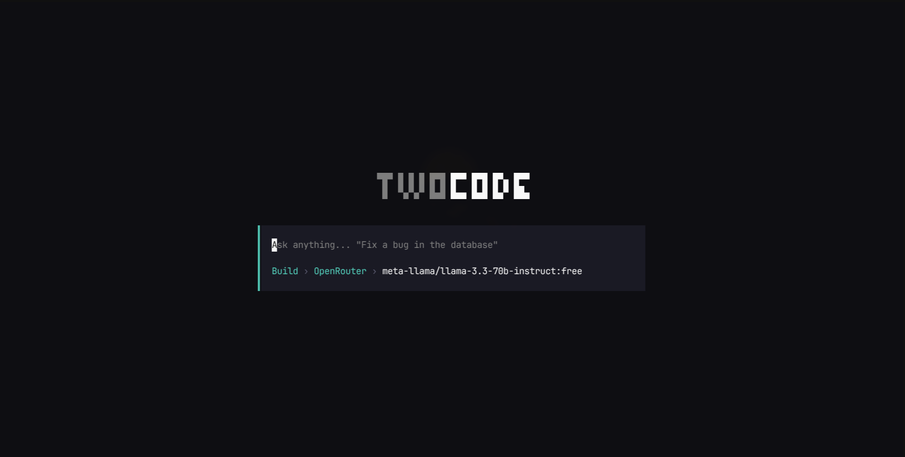
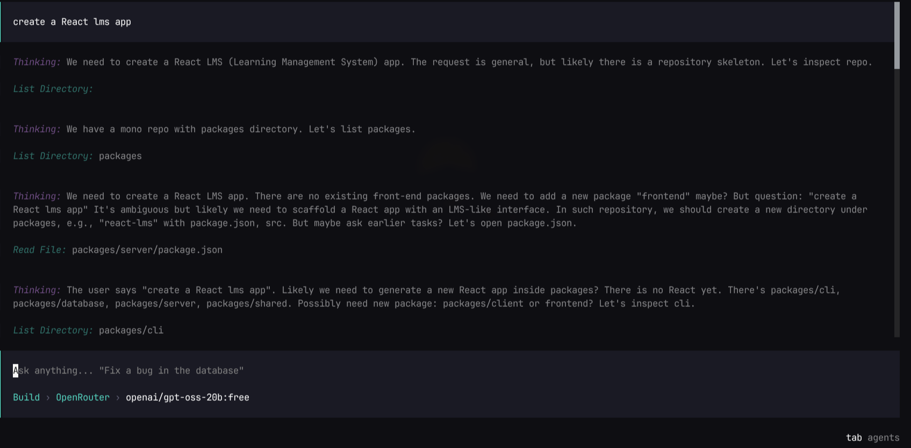

<div align="center">

<h1>TwoCode</h1>

<p>
  &nbsp;
  &nbsp;
  &nbsp;
  &nbsp;
  &nbsp;
  
</p>

</div>

<br />

## What this is

TWOCODE integrates directly into your development environment to read, write, and execute code autonomously.

It is designed to handle complex software engineering tasks by treating your entire codebase as a cohesive system rather than just looking at isolated files.

## Screenshots

<p align="center">
  
</p>

<p align="center">
  
</p>

## Status

**52 milestones complete** — the original 44-item plan, post-plan polish (45), a 5-milestone multi-provider AI feature (46-50), the ability to change an already-configured provider's key (51, via shift+enter in `/provider`), and free/billing badges in `/models` (52). Every phase that's reachable without external service credentials this environment doesn't have is done. Phases H (Clerk OAuth) and I (Polar billing) are genuinely blocked on real accounts — their stubs are the intended state until someone picks this up with real credentials in hand.

| Phase | Status | What it covers |
|---|---|---|
| A — Monorepo & tooling | ✅ Done | Bun workspaces, shared `tsconfig`, 4 scaffolded packages |
| B — Shared contracts | ✅ Done | Model registry, `Mode`, tool schemas, AI SDK tool contracts, multi-provider `PROVIDERS` registry |
| C — Database | ✅ Done | Prisma `Session` schema, migration, client singleton |
| D — Server skeleton | ✅ Done | Hono app, error handling, auth/billing stubs, full sessions CRUD, `AppType` export |
| E — CLI skeleton | ✅ Done | Static screen, full provider stack, theme switching, routing, session create/browse/resume |
| F — Chat streaming | ✅ Done (needs a key) | Real `/chat` route across 4 AI providers, `useChat` hook, full message rendering — verified end-to-end for all providers; only missing piece is a real API key for an actual reply |
| G — Tool calling | ✅ Done | Client-side execution of all 7 tools (PLAN-mode gating, sandboxing), fully real-verified with no key needed; the agentic loop (tool call → execute → continue) verified live |
| H — Real auth | ⛔ Blocked | Needs a real Clerk OAuth app — `requireAuth` stays the `dev-user` stub until then |
| I — Real billing | ⛔ Blocked | Needs a real Polar account — `requireCreditsBalance` stays a no-op until then |
| J — Polish | ✅ Done | Full command menu (theme/provider/agents/models/sessions/new/exit all real), tab-key mode toggle, focus-restoration fix |

This is a real, themed, fully-routable terminal app: `Home` → `NewSession` → `Session`, each backed by a real Postgres-persisted session. Typing a message creates a real session and lands on a real chat screen wired to a real `/chat` endpoint and a real `useChat` hook with working client-side tool execution and full message rendering (reasoning, tool calls, text, a mode/model/duration footer).

**Multi-provider AI support:** `/provider` opens a picker for Anthropic (Claude), Google (Gemini), OpenAI, and OpenRouter — a modular `PROVIDERS` registry in `@twocode/shared` means adding a fifth provider is a small, contained diff, not a rewrite. Picking an unconfigured provider prompts for an API key, validates it against that provider's real API before saving, and stores it locally at `~/.twocode/credentials.json` (owner-only permissions, never sent anywhere except as part of your own `/chat` requests, never persisted server-side). Google and OpenRouter are flagged as free-tier providers — both offer genuinely free API keys with no card required, and OpenRouter additionally accepts any custom model slug beyond its curated free list. The active provider is always visible in the status row. `/models` goes a level deeper than the provider badge: it flags individual models too, since a free-tier provider can still have paid-only models (Google's `gemini-3.1-pro-preview` requires billing even though `gemini-3.5-flash`/`gemini-3.1-flash-lite` don't).

The command menu is fully live: `/theme`, `/provider`, `/agents`, `/models`, `/sessions`, `/new`, `/exit` all do something real; `/login`, `/logout`, `/upgrade`, `/usage` show a clear toast explaining they need Phase H/I credentials, rather than silently doing nothing. The one thing not provable end-to-end is an actual model reply, since no real API key is configured for any provider — everything up to that boundary (credentials storage, key validation, session merge, tool resolution, the real request reaching each provider's API, even a down-server network failure) is real and tested; add a real key via `/provider` to see it go all the way. Run it with `bun run dev:cli` (needs `bun run packages/server/src/index.ts` running alongside it).

## Architecture

```text
packages/
├── shared/     # Model registry, Mode, Zod tool schemas, AI SDK tool contracts
├── database/   # Prisma schema (single Session model) + client singleton
├── server/     # Hono API
└── cli/        # OpenTUI + React terminal client (multi-provider chat + tool execution, needs an API key)
```

Every package is `@twocode/*`, resolved by Bun straight from `src/` via workspace `exports` — no build step for internal consumption.

## Running it locally

**Prerequisites:** [Bun](https://bun.sh), Docker. Clerk/Polar accounts aren't needed yet (Phases H/I). No AI provider key in `.env` is needed at all anymore — API keys are configured per-provider at runtime via `/provider` inside the CLI (stored at `~/.twocode/credentials.json`), not as server environment variables. Everything works without one except getting an actual model reply back from `/chat` (you'll see a real, expected auth error instead). For a genuinely free setup: Google Gemini (`aistudio.google.com/apikey`) and OpenRouter (`openrouter.ai/settings/keys`) both offer free API keys with no card required.

```bash
bun install
docker compose up -d              # starts local Postgres
cp .env.example .env              # DATABASE_URL already matches the compose service
bun run --cwd packages/database db:generate
(cd packages/database && bunx prisma migrate deploy)

bun run packages/server/src/index.ts   # http://localhost:3000/health
bun run dev:cli                        # Home -> /provider to add a free key -> type a message -> real chat
```

## Contributing to this project (with yourself)

This repo is a teaching exercise, not a race to the finish. Each session should:

1. Pick up at the next unfinished milestone — never redo, never skip ahead.
2. Explain the milestone before writing any code.
3. Verify with something real (a request, a query, a running process) — not just a passing typecheck.
4. Commit once per milestone.
